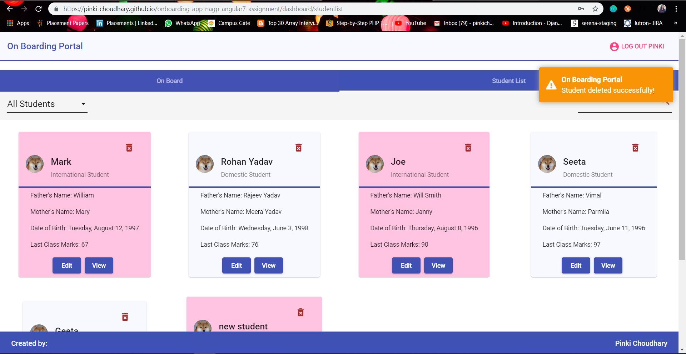

# On Boarding Portal (Created by - Pinki Choudhary)

This is a student on boarding portal.
This project was generated with [Angular CLI](https://github.com/angular/angular-cli) version 7.3.5. You can find below the step by step screenshot below of the whole app with all validations, error pages, error messages and success messages.

## Login Page

Navigate to `https://pinki-choudhary.github.io/onboarding-app-nagp-angular7-assignment/`. The app will redirect you to login page if not logged in and if you are already logged in it will take you the dashboard page. You can use my name i.e., (pinki) or (admin) or (arun) as username and password both. Below is the screenshot of the login screen.

1. Login page (Buttons are disabled when fields are blank)

2. Login page with required field error

3. Login page with invalid credentials (A message is displayed to top right corner when invalid credentials are enetered)

4. Login page with valid credentials

5. Dashboard after successful login

## Dashboard Page

When user is logged in successfully it s/he will be taken to the dashboard page which shows the onboarding form by default. And displays the existing onboarded students when Student List tab is selected. 

1. Dashboard screen (On board Form)

2. Student List page

3. If the On board form is invalid the Onboard button will be disabled.

Using the onboard form the student can be added, updated, viewed. A common form is used for all these operations.

## Add Student
On board form helps in adding the student with all valid details. If any of the field is invalid then an error message is displayed under that field and onboard button is also disabled. It also has a reset button that resets the form whenever needed.

## Edit Student
A student can be selected from the student list for updating the details.

Once a student is updated successfully, it redirects the user to student list page with a success message at the top right corner.

## View Student
A student can be viewed by selecting it from student list page. While viewing a student the form is disabled with all prefilled details.

## Delete Student
On clicking the X button of the student detail a popup apperas for the delete confirmation. When it is confirmed then only student is deleted, else no change is done in the list.

1. Delete pop

2. Delete successful (A message is displayed in the top right corner)

## Filter student by category
Student list page contains a filter option which is used to filter students by category. (By default all students displayed)
1. Domestic only students (dispalyed with off-white background)

2. International only students (displayed with pink background)

## Search student by name
Student list page contains a search bar which is used to search a student by name.
1. Search student by name only

2. Search student by name with category filter

## Error Page
Whenever a user tries some invalid url then an error page is displayed with a go to home page button. This button takes user to dashboard page if he is logged in otherwise he is redirected to login page.
1. Trying an invalid url

2. Redirected to custom error page

